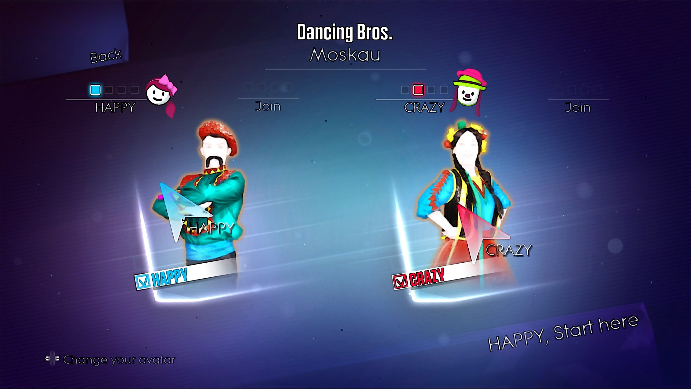

#### 项目简介 

------

**JDSE-JustdancePCSE**

舞力全开特别版启动器V2.0，实现模拟器自动配置和安卓体感游玩

Justdance PCSE Launcher V2.0，Implementing emulator auto-configuration and Android app

------

#### 基本属性 

支持语言	中文，English

开发环境	VisualStudio  & C#  WPF程序 、AndroidStudio  & Java

实现功能	自动配置模拟器，安卓连接模拟器遥控操作

第三方库	Dolphin模拟器，Dolphindroid

------

#### 使用说明

1.下载bin文件夹内启动器，网上搜索下载舞力全开wbfs游戏ROM文件，即可使用

2.将游戏的wbfs文件，以JD2016.wbfs,JD2017.wbfs..命名规则放在ROM文件夹内

3.运行启动器，使用安卓手机扫码下载App安装控制器，输入连接码连接模拟器

4.选择游戏版本，点击开始，通过手机选择歌曲，开始游玩

------

#### 更新说明 [V2.0]	

1.优化了启动器和控制器APP界面，更加美观，且便于操作

2.扩充游戏列表，支持2014-2022版本选择切换，且无须完全下载所有ROM 

3.优化了海豚模拟器配置，连接更加顺畅，支持多人游玩

4.优化了海豚模拟器着色器，画质稍微加强一点

5.支持了本地共享文件，可以扫码直接下控制器APP，免手动拷贝安装

6.优化了控制器APP一些逻辑BUG，连接更稳定和操作更加顺畅

7.集成启动必要文件，免除单独准备模拟器及其他文件，请使用管理员权限运行

------

#### 开发者的话

用爱发电，开发不易！希望得到精神鼓励，如果本项目帮到了您，麻烦点点★ star！谢谢您！

为感谢大家的支持！如果本项目★ star达到1000，我将继续开发基于yuzu的高清版本！

基于yuzu的整合版本画质高清，且支持使用iPhone体感操作！

------

#### 界面预览 

